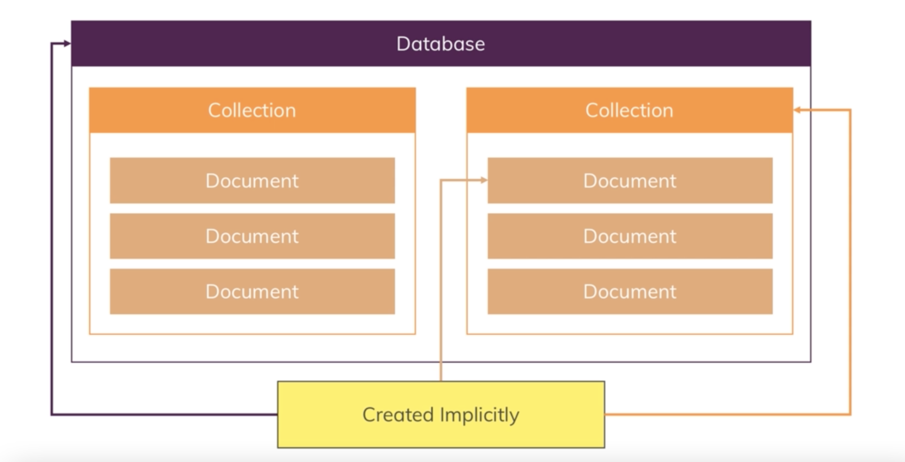
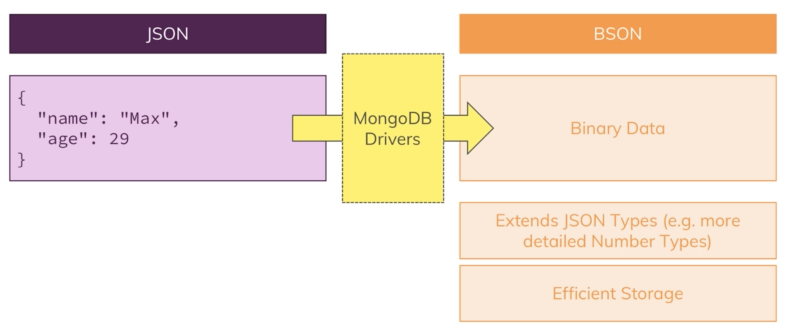
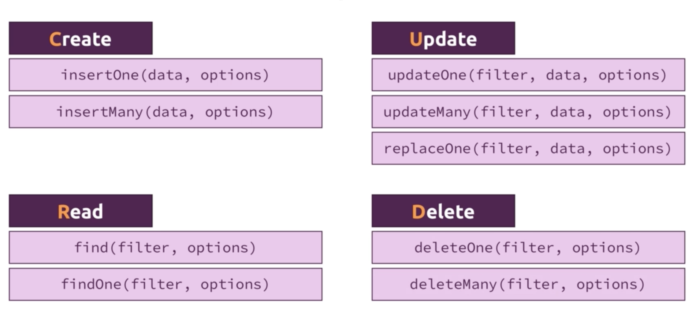
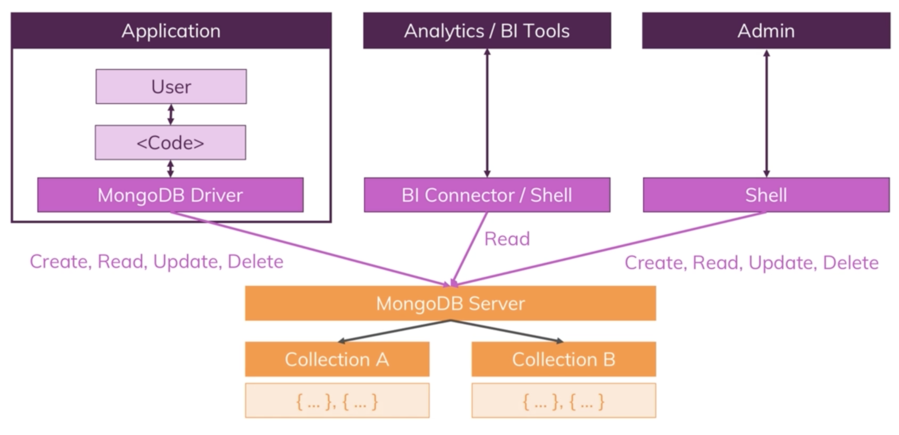
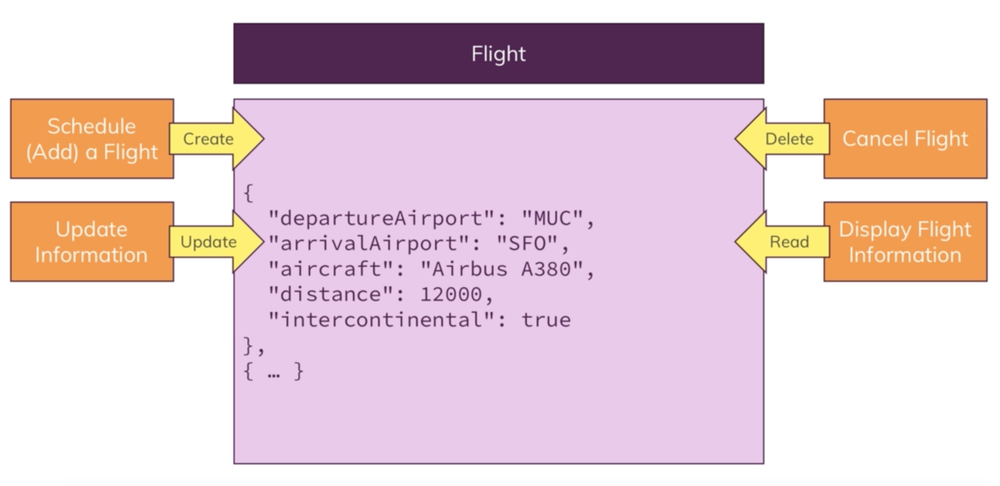
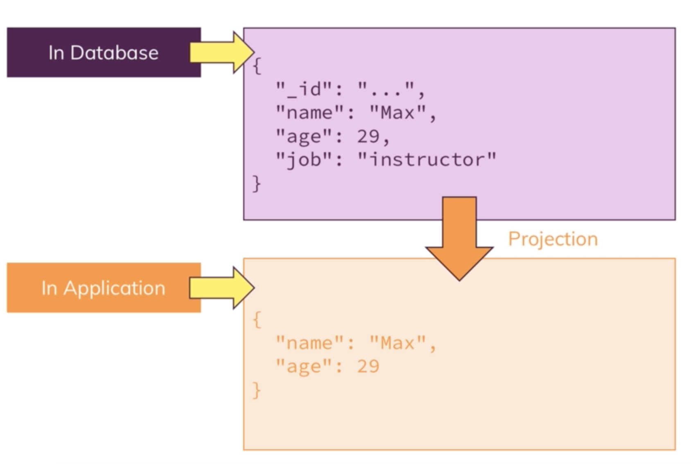
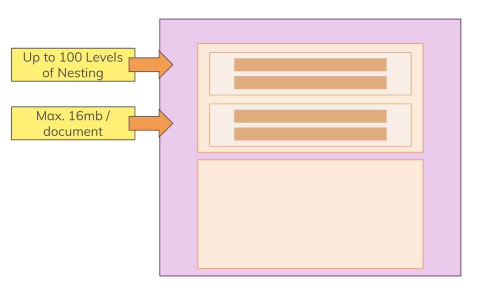
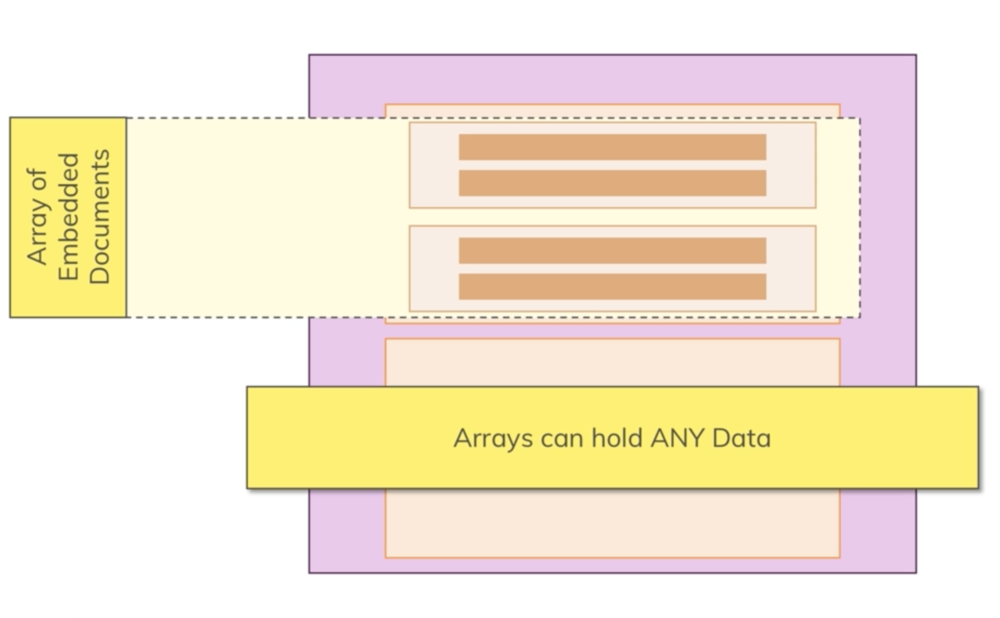

## **SECTION 02: CRUD Operations**

### [Table of Contents](#table-of-contents)

- [Understanding Database Collection Document](#understanding-database-collection-document)
- [Creating Database Collection](#creating-database-collection)
- [Understandinng JSON DATA](#understandinng-jSON-data)
- [Comparing JSON and BSON](#comparing-json-and-bson)
- [CRUD Operation & MongoDB](#crud-operation-&-mongoDB)
- [Finding Inserting Deleting Updating](#finding-inserting-deleting-updating)
- [Understandig InsertMany](#understandig-insertMany)
- [Deeper into finding Data](#deeper-into-finding-data)
- [Update Vs UpdateMany](#update-vs-updatemany)
- [Understanding find the Cursor Object](#understanding-find-the-cursor-object)
- [Understanding Projection](#understanding-projection)
- [Embedded Documents Array](#embedded-documents-array)
- [Working With Embedded Document](#working-with-embedded-document)
- [Working With Arrays](#working-with-arrays)
- [Accessinng Structure Data](#accessing-structure-data)

---

### **Understanding Database Collection Document**

#### **Databases**

- One or more Databases on the server

#### **Collection**

- database can hold one or more Collections

#### **Document**

- In Collection, documents are stored. multiple document can be stored on One Collection.

- Databases, Collections and documents are implicityly created when we store the data.

  

  **[⬆ back to top](#table-of-contents)**

---

### **Creating Database Collection**

```shell
> show dbs
```

```shell

> use users

> db.userData.insertOne(
    {
        "name": "isaac home",
        "username": "isaac",
        "email": "isaachome@april.biz"
  }
)
```

- find all documents

```shell
db.userData.find().pretty()
```

## Understandinng JSON DATA

```json
{
  "name": "isaac home",
  "username": "isaac",
  "email": "isaachome@april.biz",
  "age": 20,
  "isMarried": false
}
```

- key value paired made up
- key with double qoutation
- value with

  - different type such as boolean or number

  ```shell
  db.userData.insertOne(
      {
        "name": "isaac home",
        "username": "isaac",
        "email": "isaachome@april.biz",
        "age": 20,
        "isMarried": false
      }
  )
  ```

## **Comparing JSON and BSON**

- Mongo use BJSON for storing data.
- User will deal only JSON.
- behind the mongo convert json to bjson
- by using MongoDb Drivers

#### **Why BJSON**

- Efficiennt Storage
- additional data types

  ```shell
  "_id" : ObjectId("6066c3d0baef3a0bdc9d2a3f")
  ```

  

---

### CRUD Operation & MongoDB

- what is CRUD
  - creating new document
  - reading documents from collections
  - updating documents
  - delete documents

### CREATE

- important for creating data.
- insertOne(data,options)

  - allow single data with options.
  - directly executed on a collection.

- insertMany(data,options)

  - insert many documents once at a time.

### READ

- find(fileter,options)
  - with some argument filter and options
- findOne(filter,options)

  - first matching document.

### Update

- updateOne(filter,data,options),
- updateMany(filter,data,options)
- replaceOne(filter,data,options)
  - to replace the entire document

### Delete

- deleteOne(filter,options)
- deleteMany(filter,options)

  

---

### Why

- We might work with Application , BI tools and database administration.
- where we manupulate our data.

  

---

### Example #1

- with flightData
- user will add a flight ,
- update information
- Cancel flight
- Display flight information

  

---

### **Finding Inserting Deleting Updating**

- find all
  - without filter

```shell

  db.userData.find().pretty();

```

- using filter

```shell
 db.userData.find({_id:ObjectId("606be36635ad5404b4c23dfc")}).pretty()
```

- **_findOne()_**
  - find element that match first

```shell
db.userData.findOne();
```

---

### **Insert Document**

- insert new element

```shell

$ db.userData.insertOne(
  {
    "name": "isaac home",
    "username": "isaac",
    "email": "isaachome@april.biz",
    "address": {
    "street": "Kulas Light",
    "suite": "Apt. 556",
    },
    "phone": "1-770-736-8031 x56442",
    "website": "hildegard.org",
    "company": {
    "name": "Romaguera-Crona",
    "catchPhrase": "Multi-layered client-server neural-net",
    "bs": "harness real-time e-markets"
    }
  }
);

```

---

### **Update Document**

- update new field in the document using **_$set operator_**

- $ is reserved operator

- $set to update new field at existing document

```shell
$ db.userData.updateOne(
    {_id:"606be280a4205504b45c7fc4"},
    {
      $set:{
      marker:"raw"
      }
    }
  );
```

- updateMany leave empty filter

```shell

 $ db.userData.updateMany({},{$set:{marker:"raw"}});

 $ db.userData.find({marker:"raw"}).pretty();

```

---

### **Delete Document**

- delete document
  - take filter to match on which key and value.
  - deleteOne({})

```shell

  db.userData.deleteOne({username:"isaac"})

```

- deleteMany({})
  - must all document have common fields
  - or can delete all document with empty filter

```shell
db.userData.deleteMany({marker:'raw'});

db.userData.deleteMany({});
```

---

### **Understandig InsertMany**

- To insert many documentm(array objects) at once.

  - insertMany()

  - it take array []

```shell
db.blog.insertMany(
  [
    {
    "userId": 1,
    "id": 1,
    "title": "sunt aut facere optio reprehenderit",
    "body": "quia et suscipit"
    },
    {
    "userId": 1,
    "id": 2,
    "title": "qui est esse",
    "body": "est rerum tempore "
    }
  ]
);
```

---

### **Deeper into finding Data**

```shell
 db.blog.find({title : "qui est esse"}).pretty()
```

- using operator
  - the general form

```shell
 { field : { $gt : value } }

db.blog.find({age:{$gt:9}}).pretty()

```

---

### **Update Vs UpdateMany**

- updateOne() take filter which to update

- when we want to update specific data (partially)

- updateMany()

#### **caution**

- update() take filter and object to update but it replace the entire document

  ```shell
  db.blog.update({_id:ObjectId("606be9bdf64d9a04b473fea4")},{name:"isaachome"});
  ```

  **note**:

  - _update({},{})_ without $set operator is not allowed in _updateOne()_ and _updateMany()_ but only at _update()_.

- for replace use

```shell
 db.blog.replaceOne({},{});
```

---

### Understanding find the Cursor Object

- find() give first 20 result .
- Type "ite" for more.

#### **what does it means?**

- find() does not give all the array documents in Collection.
  - if Collection have 20 millions of document and give all the document at once.
- instead find() give Cursor Object

  - Cursor object is with meta other thing

  - Cycle through Results.

  - it use to fetch the next data from Collectionn

- to fetch all the document

#### toArray()

```shell
db.passager.find().toArray()
```

#### forEach()

```swift
db.passager.find().forEach((p)=>{printjson(p)});
```

Note:

- find() give Cursor Object where we can use extra methods such as toArray(), forEach() and pretty() .... etc.

- that'y we can not use findOne().pretty()

### Understanding Projection

- filter only wanted fields from database

  

- how
  - using 1 to include the field
  - and 0 to explicitly the field
  - note : \_id is always included.

```shell
 db.passengers.find({},{name:1}).pretty()
 db.passengers.find({},{name:1,_id:0}).pretty()
```

- this happen in mongo database
- before it ship to the application
- so we don't get unecessary data fields.

---

### Embedded Documents Array

- Core feature of mongodb

- in A Document You can store

  - Embedded Document (nested document)

  - up to 100 Levels of nesting

  - 16 mb per document

  - Arrays which can hold ANY DATA

#### Embedded Document



### Arrays Document



---

### Working With Embedded Document

```shell
db.flightData.updateMany(
  {},{
    $set:{
      status:{
        description:"on-time",
        lastupdated:"1 hour ago"
        }
    }
  });

{
	"_id" : ObjectId("6020cec3841bedbccd56b0db"),
	"departureAirport" : "LHR",
	"arrivalAirport" : "TXL",
	"aircraft" : "Airbus A320",
	"distance" : 950,
	"intercontinental" : false,
	"status" : {
		"description" : "on-time",
		"lastupdated" : "1 hour ago"
	}
}
```

---

### Working With Arrays

```shell
 db.insertOne({
   "name":"Albert",
   "age":30,
   "hobbies":[
     "Sports",
     "Cookinng",
   ]
 })
```

---

### Accessinng Structure Data

- only array from documennt.

```shell
db.passengers.findOne({},).hobbies
```

- passenager with hobbies

```shell
 db.passenngers.find({hobbies:"sports"}).pretty();
```

- queryinng Object Data.

- using dot . operation in embadded fields.

- without dot it will not unknown fields.

```shell
db.flightData.find({
  "status.description":"on-time"
}).pretty();
```

- nested fields

```shell
db.flightData.find({
  "status.details.responsible":"isaac"
}).pretty();
```
