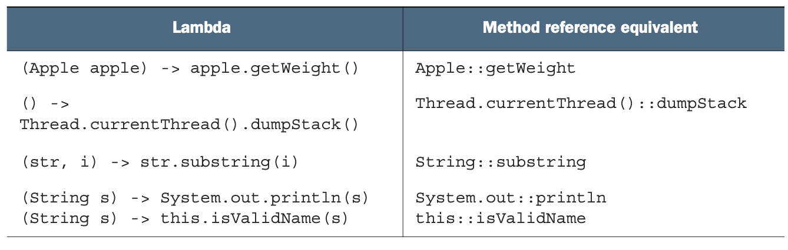

## Data Schemas and Data Modelling

- ### Storing Your Data Correctly

### [Table of Contents](#table-of-contents)

- [Why Do We Use Shcemas](#why-do-we-use-schemas)

---

### Why Do We Use Shcemas

- Schemas :

  - the structure of one document

- MongoDB enforces no schemas !

- Documents don't have to use the same schemas inside of one collection.

- example

```shell

// one product inserted with name and price in one Collection products
db.products.insertOne({name:"A Book",price:1.99});

// another product with title and seller in the same Collection products.
db.products.insertOne({title:"T-shirt",seller:{name:"Isaachome",age:29}});

```


